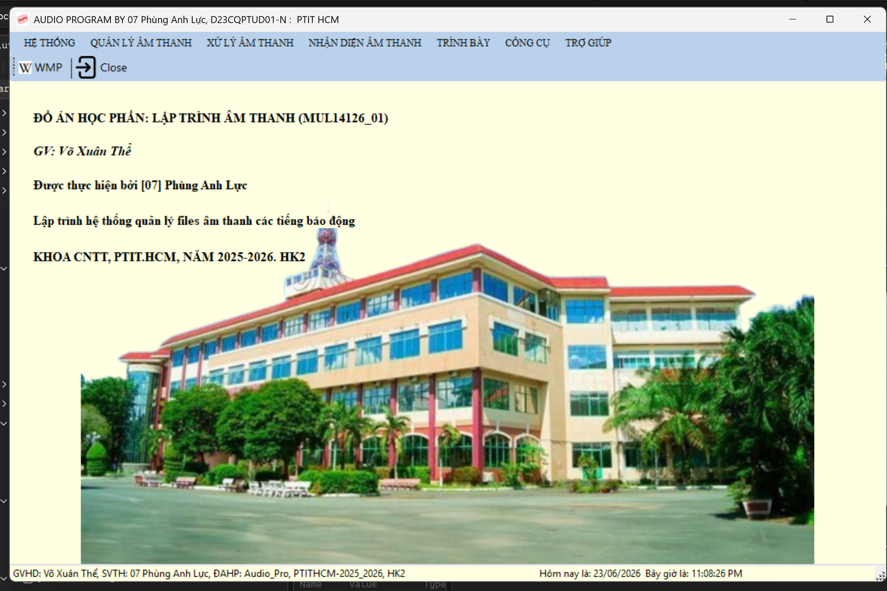
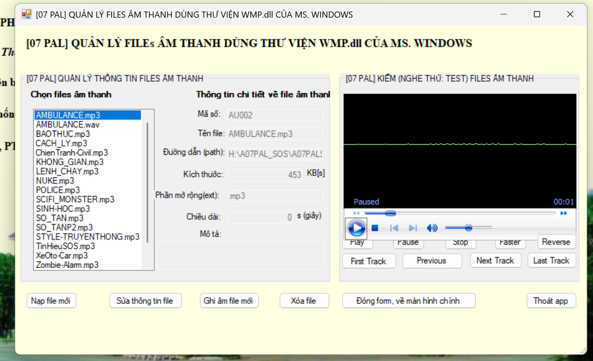
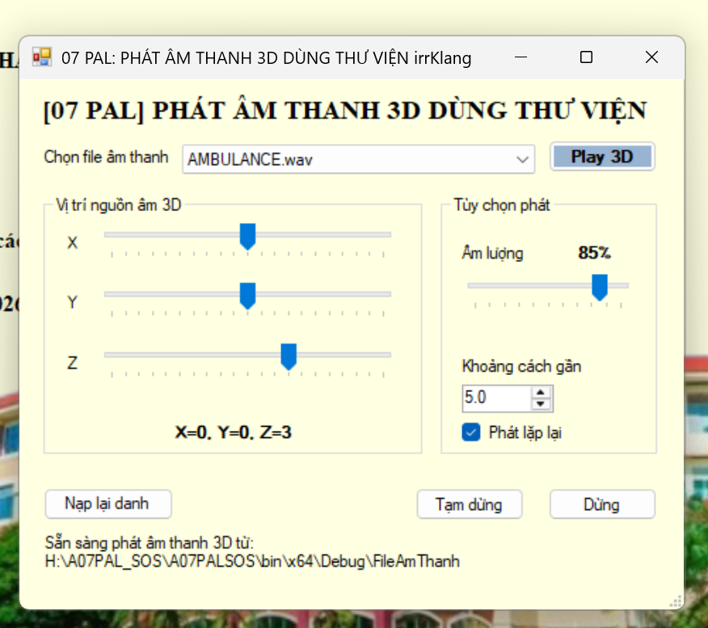

# A07PALSOS

Ứng dụng WinForms quản lý và phát các file âm thanh cảnh báo, hỗ trợ phát thử bằng Windows Media Player và phát âm thanh 3D bằng thư viện irrKlang.

## Hình ảnh

### Main Form


-> Main form hiển thị danh sách file âm thanh, cho phép phát thử bằng Windows Media Player và phát âm thanh 3D bằng irrKlang.

---
### Quản lý âm thanh WMP

-> Form quản lý âm thanh bằng Windows Media Player, cho phép phát, tạm dừng, dừng và chuyển track.

---
## Phát âm thanh 3D irrKlang



Form phát âm thanh 3D bằng irrKlang, cho phép chỉnh vị trí nguồn âm theo trục X/Y/Z.

## Tính năng

- Quản lý danh sách file âm thanh trong thư mục `FileAmThanh`.
- Phát, tạm dừng, dừng và chuyển track bằng Windows Media Player.
- Phát âm thanh 3D bằng irrKlang, chỉnh vị trí nguồn âm theo trục X/Y/Z.
- Lưu dữ liệu cục bộ bằng file `Data/AudioFiles.xml`, không cần cài SQL Server.
- Đóng gói release kèm sẵn âm thanh và thư viện cần thiết.

## Yêu cầu

- Windows 64-bit.
- .NET Framework 4.8.1.
- Windows Media Player còn được bật trên Windows.

> Bản hiện tại dùng irrKlang 64-bit, nên không hỗ trợ Windows 32-bit.

## Cách chạy

1. Tải file release `.zip` từ GitHub Releases.
2. Giải nén toàn bộ thư mục.
3. Chạy `A07PALSOS.exe`.

Không di chuyển riêng file `.exe` ra khỏi thư mục release, vì ứng dụng cần các file DLL và thư mục `FileAmThanh` đi kèm.

## Cấu trúc release

```text
A07PALSOS.exe
A07PALSOS.exe.config
FileAmThanh/
Data/
irrKlang.NET4.dll
irrKlang.dll
ikpMP3.dll
ikpFlac.dll
FontAwesome.Sharp.dll
AxInterop.WMPLib.dll
Interop.WMPLib.dll
```


## Thông tin

Đồ án học phần Lập trình âm thanh, PTIT HCM, năm học 2025-2026.
